# 概要
* Github(プライベートリポジトリ:非公開) の自由なフォルダに README.md を作って、時程表と想定問答集、テキスト目次などをおいておくと、移動中にさっと見れて便利！
* 以下サンプル

# Time Table

```mermaid
    gantt
    title 試験時程(1日目)
    dateFormat  HH:mm
    axisFormat %H:%M
    todayMarker stroke-width:3px,stroke:crimson
    section 準備
    準備           :pre, 11:00, 30m
    勉強          :study, 11:30, 30m
    昼食            :lunch, 12:00, 10m
    section 行き
    車移動           :car1, 12:10, 30m
    電車            :train1, 12:44, 14:49
    徒歩            :walk1, 15:00, 15m
    section 試験
    試験            :Exam, 16:30, 60m
    section 帰り
    徒歩            :walk2, 18:30, 15m
    電車            :train2, 19:00, 21:06
    車移動           :car2, 21:20, 30m
```

# 答案練習

## テーマ1 例：XXX

### XXX について、 AAA と BBB をふまえて説明せよ

### XXX を、 CCC と比較しながら説明せよ

### XXX　の特徴を、3つに整理して説明せよ

## テーマ2 例：YYY

### YYY について説明せよ