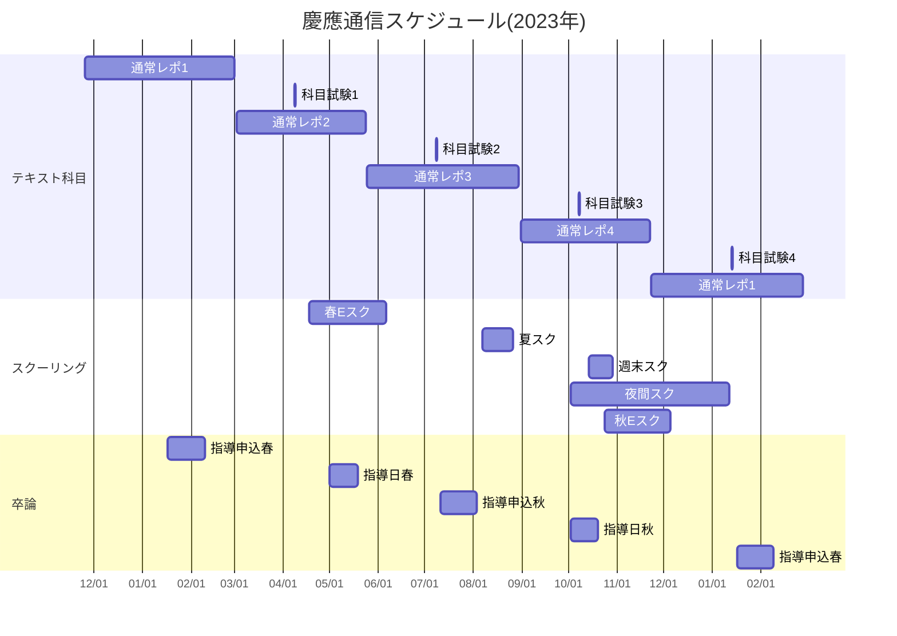

```mermaid
gantt
  title 慶應通信スケジュール(2023年)
  dateFormat YY-MM-DD
  axisFormat  %m/%d

  section テキスト科目
  通常レポ1: 22-11-25, 23-03-01
  科目試験1: 23-04-08, 23-04-09
  通常レポ2: 23-03-02, 23-05-24
  科目試験2: 23-07-08, 23-07-09
  通常レポ3: 23-05-25, 23-08-30
  科目試験3: 23-10-07, 23-10-08
  通常レポ4: 23-08-31, 23-11-22
  科目試験4: 24-01-13, 24-01-14
  通常レポ1: 23-11-23, 24-02-28

  section スクーリング
  春Eスク: 23-04-18, 23-06-06
  夏スク: 23-08-07, 23-08-26
  週末スク: 23-10-14, 23-10-29
  夜間スク: 23-10-02, 24-01-12
  秋Eスク: 23-10-24, 23-12-05

  section 卒論
  指導申込春: 23-01-17, 23-02-10
  指導日春: 23-05-01, 23-05-19
  指導申込秋: 23-07-11, 23-08-03
  指導日秋: 23-10-02, 23-10-20
  指導申込春: 24-01-17, 24-02-09
```
